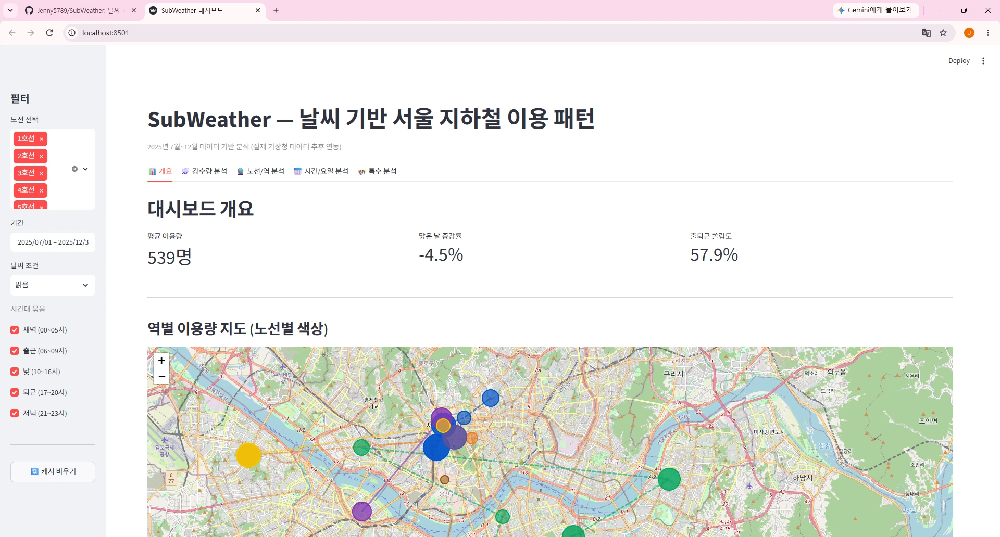
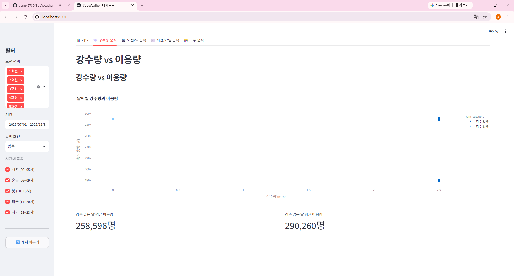
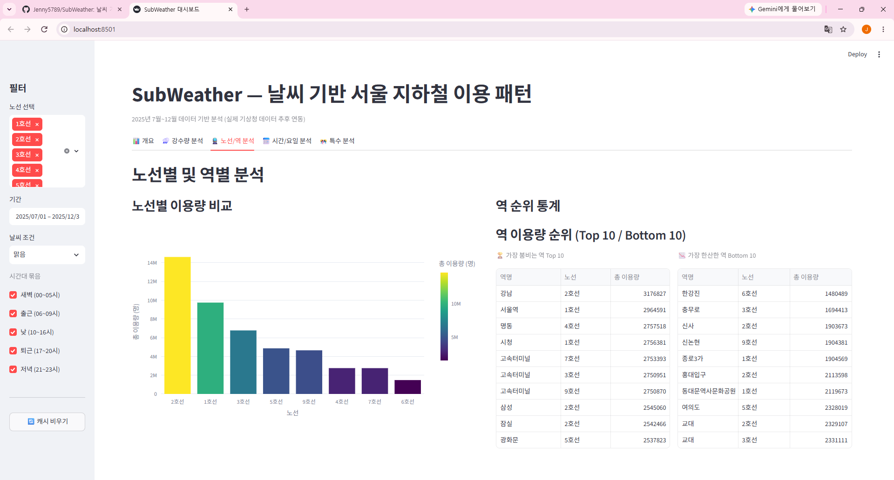
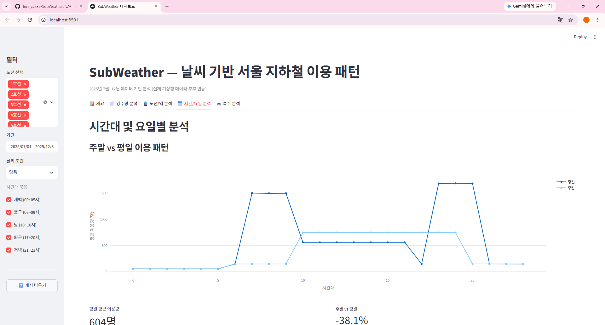
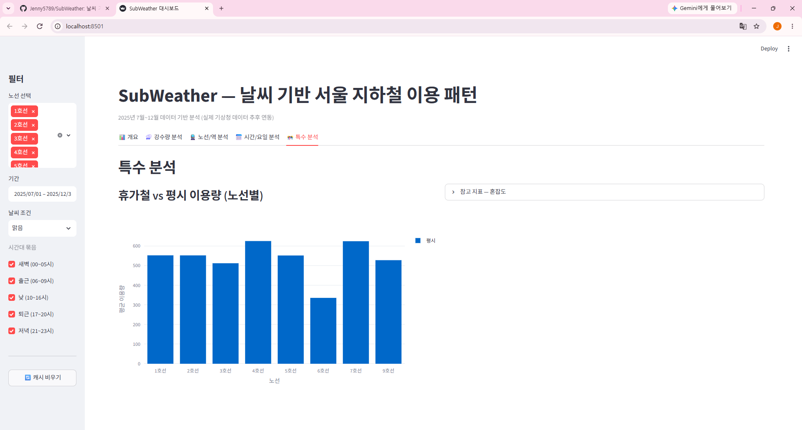

# SubWeather 🚇🌧️

**날씨 기반 서울 지하철 이용 패턴 분석 대시보드**

강수량, 기온, 습도 등 기상 데이터와 지하철 이용 데이터를 연결해 날씨에 따른 지하철 이용 패턴의 변화를 시각화합니다.

🔗 **Live Demo:** https://subweather.streamlit.app

---

## ✨ 주요 기능

### 📊 개요 탭
- 평균 이용량, 날씨별 증감률, 출퇴근 쏠림도
- 노선별 색상 구분된 서울 지하철 노선도
- 이용량에 따라 버블 크기 변화

### 🌧️ 강수량 분석
- 강수량 vs 지하철 이용량 산점도
- 비가 오는 날씨 영향도 분석

### 🚆 노선/역 분석
- 호선별 이용량 비교
- 상위/하위 역 순위 통계

### 📅 시간/요일 분석
- 평일 vs 주말 패턴 비교
- 시간대별 이용량 추이

### 🎊 특수 분석
- 휴가철 영향도
- 혼잡도 통계

---

## 🛠️ 기술 스택

- **프레임워크**: Streamlit
- **데이터 처리**: Pandas, NumPy
- **시각화**: Plotly Express, Folium
- **배포**: Streamlit Cloud
- **데이터**: KMA 기상청 API, 서울 공개 데이터

---

## 📈 데이터

### 수집 범위 (2025년 7월~12월)
- 기상 데이터: 기온, 강수량, 습도, 풍속
- 지하철 데이터: 20개 주요 역 시간별 승하차
- 혼잡도 데이터: 1~9호선 통계

### 처리 방식
1. 시간대별 묶음: 새벽/출근/낮/퇴근/저녁
2. 날씨 분류: 맑음/비/폭염/한파
3. 역-기상소 매칭: Haversine 거리 기반

---

## 🚀 사용 방법

### 로컬 실행
```bash
git clone https://github.com/Jenny5789/SubWeather.git
cd SubWeather
pip install -r requirements.txt
streamlit run dashboard/app.py
```

### 온라인 접속
https://subweather.streamlit.app

---

## 📁 프로젝트 구조

```
SubWeather/
├── dashboard/app.py           # Streamlit 대시보드
├── src/collectors/            # 데이터 수집
├── tests/fixtures.py          # 테스트 데이터
├── scripts/                   # 데이터 수집 스크립트
├── requirements.txt
└── README.md
```

---

## 🎨 시각화 특징

- **노선별 색상**: 서울 지하철 공식 색상 적용
- **버블 맵**: 이용량에 따른 크기 변화
- **노선 연결선**: 각 호선의 경로 표시
- **인터랙티브 차트**: Plotly 동적 그래프

---

## 🔄 향후 개선

- 276개 전 역 데이터 추가
- 실제 API 데이터 연동
- 머신러닝 예측 모델
- 특수일 분석 강화

---

## 📝 라이선스

MIT License

---

## 📸 스크린샷

### 개요 탭 - 서울 지하철 노선도
노선별 색상으로 구분된 지도. 버블 크기는 이용량을 나타냅니다.


### 강수량 분석
강수량과 지하철 이용량의 관계를 보여주는 산점도입니다.


### 노선/역 분석
호선별 이용량 비교와 상위/하위 역 순위입니다.


### 시간/요일 분석
평일과 주말의 시간대별 이용 패턴 비교입니다.


### 특수 분석
휴가철 영향도와 호선별 혼잡도 통계입니다.

